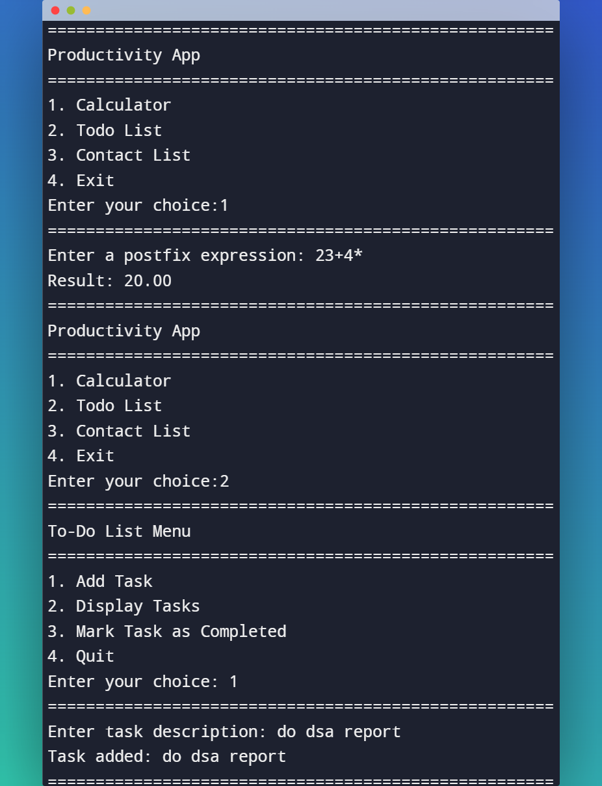

## Productivity_App
Productivity App has 3 sub programs, Calculator (postfix calculation) using stack, Todo list using Linked list, Contact List using doubly Linked list
## Demo

## Installation

To try this program yourself:
- download the code or clone this repo
- make sure you have C compiler or you can use an online compiler
- run the code

## Contributing:

Pull requests are welcome. For major changes, please open an issue first
to discuss what you would like to change.

Please make sure to update tests as appropriate.
